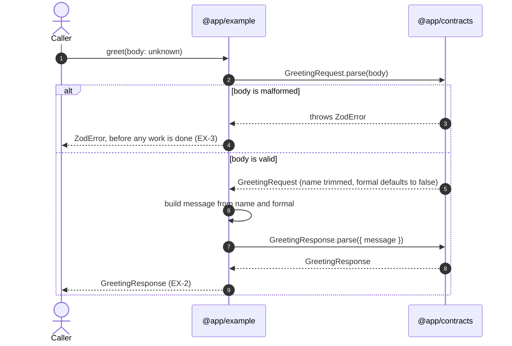

# Greeting request

How `@app/example` answers a greeting request, including the rejection path (spec: EX-1, EX-2, EX-3).

```mermaid
sequenceDiagram
  autonumber
  actor Caller
  participant example as @app/example
  participant contracts as @app/contracts

  Caller->>example: greet(body: unknown)
  example->>contracts: GreetingRequest.parse(body)
  alt body is malformed
    contracts-->>example: throws ZodError
    example-->>Caller: ZodError, before any work is done (EX-3)
  else body is valid
    contracts-->>example: GreetingRequest (name trimmed, formal defaults to false)
    example->>example: build message from name and formal
    example->>contracts: GreetingResponse.parse({ message })
    contracts-->>example: GreetingResponse
    example-->>Caller: GreetingResponse (EX-2)
  end
```
